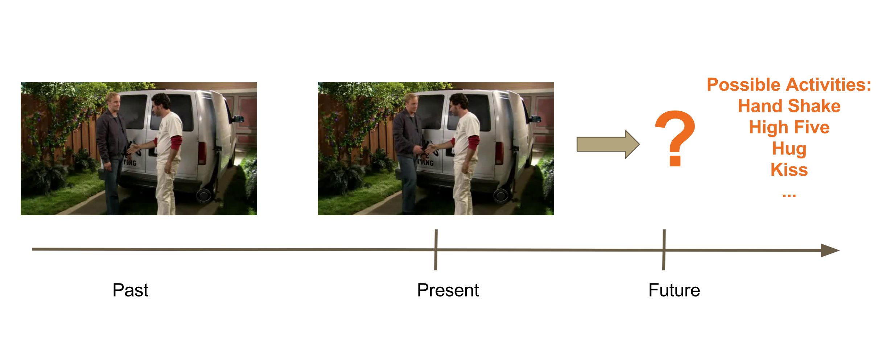
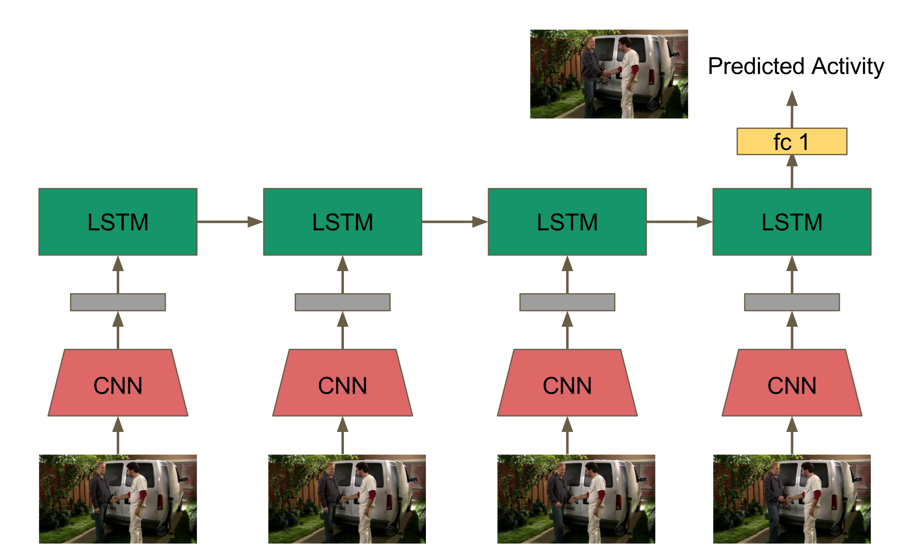
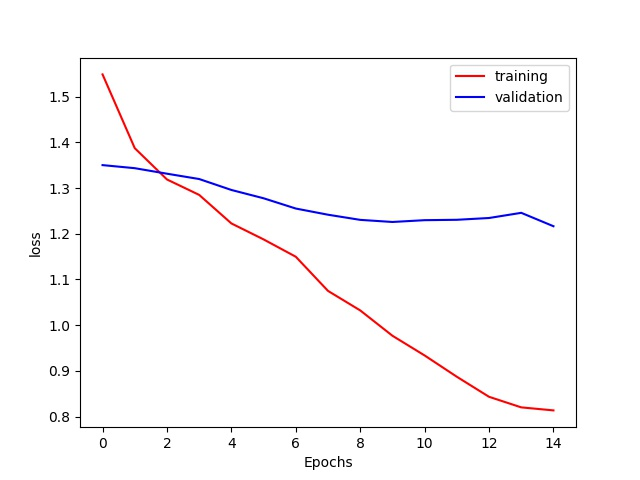
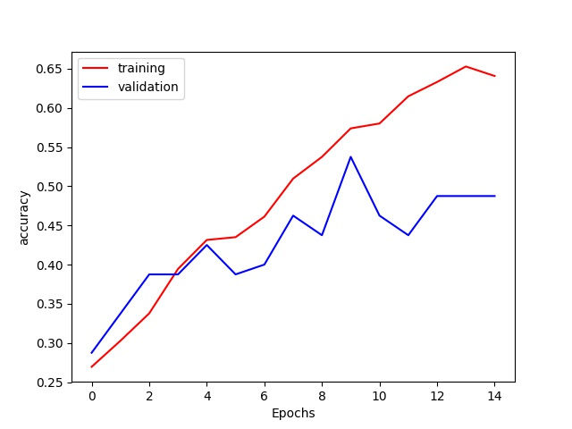

# activity-anticipation
Human activity anticipation from videos using an LSTM-based model.

## Requirements
- Python
- NumPy
- Tensorflow 1.0
- scikit-image
- Matplotlib

## Model
Extract features from each frame with a CNN and pass the sequence to an LSTM, in a separate network. 

## Data
I use the [TV Human Interactions (TVHI) dataset](http://www.robots.ox.ac.uk/~alonso/tv_human_interactions.html). The dataset consists of people performing four different actions: hand shake, high five, hug, and kiss, with a total of 200 videos (excluding the clips that don't contain any of the interactions).
-  [tv\_human\_interactions\_videos.tar.gz](http://www.robots.ox.ac.uk/~alonso/data/tv_human_interactions_videos.tar.gz)
-  [tv\_human\_interactions\_annotations.tar.gz](http://www.robots.ox.ac.uk/~alonso/data/tv_human_interactions_annotations.tar.gz)

Please extract the above files and store the videos inside the `./videos` directory, annotations inside the `./annotations` directory. 

For the CNN, I use Inception V3, pre-trained on ImageNet.
- [inception\_v3\_2016\_08\_28.tar.gz](http://download.tensorflow.org/models/inception_v3_2016_08_28.tar.gz)

Extract the compressed file and put `inception_v3.ckpt` into the `./inception_checkpoint` directory.

## Usage
First, extract features from the frames before the annotated action begins in each video:
	$ python preprocessing.py
Then, generate the `train_file.csv` file containing the ground\_truth label information of the dataset:
 	$ python generate\_video\_mapping.py
To train the model with default parameters:
	$ python train.py

## Performance
|Activity|# of training data|# of augmented training data|# of validation data|
|:---:|:---:|:---:|:---:|
|hand shake|27|315|20|
|high five|30|320|20|
|hug|30|362|20|
|kiss|28|293|20|
 
Train the model for 15 epochs.

## Related works
